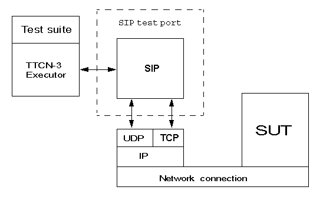

= SIPmsg Test Port for TTCN-3 Toolset with TITAN, Description
:author: Gábor Szalai
:revnumber: 1551-CNL 113 319, Rev. D
:revdate: 2017-04-11
:toc:

=== How to Read This Document

The SIPmsg test port is developed for the TTCN-3 Toolset with TITAN.

=== Presumed Knowledge

The knowledge of the TITAN TTCN-3 Test Executor and the TTCN-3 language is essential.

= Functionality

The SIPmsg test port implements the message structure of the SIP protocol in a formalized way, using the standard specification language TTCN-3. It also implements the connection between test suite and SUT using TCP/IP or UDP/IP protocol.

== Implemented Protocols

The test port implements all protocol messages and elements described in RFC 3261, RFC 2806, RFC 2976, RFC 3262, RFC 3311, RFC 3323, RFC 3325, RFC 3326, RFC 3265, RFC 3455, IETF Draft draft-ietf-dip-session-timer-15.txt, RFC 3428, RFC 3515, RFC 3841, RFC 3313, RFC 3327, RFC 3329, RFC 3603, RFC 3608, RFC 3891, RFC 3892, RFC 3903, RFC 3911, RFC 3420, IETF Draft draft-levy-sip-diversion-08.txt, RFC 4244, RFC 4488, draft-ietf-sip-refer-with-norefersub-04, draft-allen-sipping-poc-p-headers-01, RFC 5009, draft-kaplan-sip-session-id-02, RFC 5502, RFC 5002, RFC 4457, RFC 4412, draft-ott-sip-serv-indication-notification-00, RFC 6442, Indication of features supported by proxy draft-holmberg-sipcore-proxy-feature-04, RFC 4538, RFC 6086, RFC 6050, FEATURE CONCEPT STUDY ICBS and Flexible Charging Support for Japan, CPM Conversation Functions

[[non-standard-wildcarded-uri-support]]
== Non-Standard Wildcarded URI Support.

The decoder supports a wildcarded URI format described in. The support is controlled by a test port and function parameters.

== Routing Functionality

Routing functionality is not performed.

== Modified and Non-Implemented Protocol Elements

None.

== Ericsson-Specific Changes

There is no Ericsson specific change in this product.

== Backward Incompatibilities

None.

== System Requirements

In order to operate the SIPmsg test port the following system requirements must be satisfied:

* TITAN TTCN-3 Test Executor R7A (1.7.pl0) or higher installed.
+
NOTE: This version of the test port is not compatible with TITAN releases earlier than R7A. The usage of TITAN releases earlier than R8A is not recommended because this version of the test port is prepared to handle the big integer numbers which feature is introduced in TITAN R8A. The usage of TITAN releases earlier than R8A can result a dynamic test case error.

* _gcc_, _make_, _makedepend_ utilities installed
* Network interface

= Feature List

== Message Handling

The test port can handle SIP request and SIP response messages and it can use both UDP and TCP connection to send and receive messages.

=== Encoding Messages

The built in encoder can encode SIP request and SIP response messages and it is possible to send raw and fragmented <<_27,[27]>> messages through the test port.

The encoding consists of three steps:

1.  Encoding the request or response line
2.  Encoding headers
3.  Adding message body.

The name of the header can be encoded in short or long format. Multiple header fields can be encoded as a comma separated list or several header rows. The behavior of the test port is controlled by test port parameter.

=== Decoding Messages

After all headers are received the messages are parsed. The parser is implemented using Bison and Flex. The parser accepts all valid message formats.

The error behavior of the test port is controlled by test port parameters. The test port can ignore any decoding errors and discard the message silently or pass the erroneous message to the test case as a RAW message or issue an error.

The parser can be deactivated by test port parameter. In that case the received messages are passed in raw format to the test case.

After the parsing is finished the message body is extracted from the buffer if it exists.

== Network Handling

The test port has two different network handling method:

* Basic mode

* Advanced mode

The local host name and port number can be set in both modes.

=== Source Port Number of The Sent Messages

When the SIP test port sends UDP packets the source port number can be either the listening port number or a random port number chosen by the operating system. The behavior of the test port is controlled by the parameter `random_udp_sending_port`. When the SIP test port establishes a TCP connection the source port is always selected by the operating system because it is not possible to open more than one TCP connection from one TCP port.

=== Basic Mode

In basic mode the test port can handle only one TCP connection or one UDP socket. It is not possible to send and receive messages using both protocols at the same time, but the test port can switch between protocols and remote hosts.

==== Start-Up Operation

During the map operation the test port checks the default protocol and the default target host name. If the default target host name is specified in the config file the port establishes connection with the specified host. That means the port opens a TCP connection if the default protocol is TCP or the port opens a UDP socket if the default protocol is UDP.

If no default target host is specified the port opens a listening socket (UDP or TCP according to the default SIP protocol) if listening is enabled.

==== Accepting TCP Connections

The test port can accept only one incoming TCP connection if listening is enabled. After the port accepts the incoming connection request, the listening socket will not be closed but the port also will not accept new connections until the current TCP connection is closed.

==== Receive Messages

The port can receive messages through the opened TCP connection or on the opened UDP socket.

In the case of TCP the test port uses a buffer to assemble the whole message if it is received in multiple TCP packets.

==== Sending Messages

When sending of a message is requested the port first compares the parameters (target host name, port number and protocol) of the current connection with the requested parameters.

If there is any difference in the parameters the test port closes the current connection and opens a new one.

If the size of the message exceeds the MTU size and the protocol applied is UDP the messages will not be sent and a TTCN error will be generated. The MTU size check can be disabled. The default MTU length is 1300 octets.

=== Advanced Mode

In advanced mode the test port can handle several TCP connections and listen on both UDP and TCP ports at the same time.

Each connection is distinguished by the protocol id, remote host name and the remote port number.

Any connection including the listening sockets can be opened and closed during run time using the `ASP_SIP_open` and `ASP_SIP_close` messages.

[[start-up-operation-0]]
==== Start-up Operation

During map operation the test port opens the listening socket according to the listen settings. The port opens a UDP socket or TCP listening socket or both.

If the target host name is specified and the default protocol is TCP the test port opens a TCP connection to the specified host.

[[accepting-tcp-connections-0]]
==== Accepting TCP Connections

The port can accept any number of connection requests on the listening port. After accepting a connection the port is ready to send and receive messages over it and it is able to accept a new one.

[[receive-messages-0]]
==== Receive Messages

The port can receive messages through any opened TCP connections or on the opened UDP socket at the same time

In case of TCP the test port uses a buffer to assemble a full message if it is received in multiple TCP packets. Every TCP connection has its own buffer.

[[sending-messages-0]]
==== Sending Messages

When sending of a message is requested the port first compares the parameters (target host name, port number and protocol) of the current connections with the requested parameters.

If there is no open connection towards the requested host and port the test port will open a new one.

If the size of the message exceeds the MTU size and the protocol applied is UDP the messages will not be sent and a TTCN error will be generated or an `ASP_SIP_error` will be sent to the test case. The MTU size check can be disabled. The default MTU length is 1300 octets.

==== Transport Error Handling

The test port is able to generate TTCN error or send `ASP_SIP_error` message to the test case in the case of the transport layer error (eg. send or receive operation failed). The test port behavior is configured via run time configuration file.

= Protocol Modules

== Overview

The SIPmsg test port provides a connection between the executable test suite and the system under test. The test port opens IPv4 sockets, closes the sockets, encodes and sends SIPmsg messages through the socket and decodes the received SIPmsg messages.

See the overview of the test system using SIPmsg test port below:

== Installation

Since the SIPmsg test port is used as a part of the TTCN-3 test environment this requires TTCN-3 Test Executor to be installed before any operation of the SIPmsg test port.

The package contains:

* one or more TTCN-3 files with the messages and attributes supported by the test port

* one or more C++ header and source files using the test port template

The packages include the following files:

* __SIPmsg_Types.ttcn__
* __SIPmsg_PortTypes.ttcn__
* __SIP_parse.h__
* __SIP_parse.l__
* __SIP_parse.y__
* __SIP_parse_.tab.c__
* __SIP_parse_.tab.h__
* __lex.SIP_parse_.c__
* __SIPmsg_PT.hh__
* __SIPmsg_PT.cc__

NOTE: All files need to be added to the _.prj_ project file in TITAN GUI, except the _.l_ and _.y_ files.

=== Description of the Files in the Package

[[sipmsg-types-ttcn-and-sipmsg-porttype-ttcn]]
==== __SIPmsg_Types.ttcn__ and __SIPmsg_PortType.ttcn__

Contains the TTCN-3 structure of the SIP messages, the definitions of message types, attributes, parameters, types and ports. The user should never change this file.

[[sipmsg-pt-hh-sip-parse-h]]
==== __SIPmsg_PT.hh__, __SIP_parse.h__

C++ header file of the SIPmsg test port. The user should never change this file.

[[sipmsg-pt-cc-sip-parse-tab-c-sip-parse-tab-h-lex-sip-parse-c]]
==== __SIPmsg_PT.cc__, __SIP_parse_.tab.c__, __SIP_parse_.tab.h__, __lex.SIP_parse_.c__

The files containing the implementation of the SIPmsg test port. The user should never change these files.

[[sip-parse-l-sip-parse-y]]
==== __SIP_parse.l__, __SIP_parse.y__

Parser and lexer source files. Not needed for the compilation of the test port. Used to generated __SIP_parse_.tab.c__, __SIP_parse_.tab.h__, __lex.SIP_parse_.c__ files. The user should never change these files.

== Configuration

The executable test program behavior is determined via the run-time configuration file. This is a simple text file, which contains various sections (e.g. `[TESTPORT_PARAMETERS]`) after each other. The usual suffix of configuration files is _.cfg_.

=== SIP Parameters in the Configuration File

The test port parameters section is introduced by the keyword `[TESTPORT_PARAMETERS]`.

In this section you can specify parameters that are passed to the SIPmsg test port. Each parameter definition consists of a component name, a port name, a parameter name and a parameter value. The component name can be either an identifier or a component reference (integer) value. The port and parameter names are identifiers while the parameter value must be always a charstring (with quotation marks). Instead of component name or port name (or both of them) the asterisk ("*") sign can be used, which means "all components" or "all ports of the component".

All parameters are optional. Because the listening is not enabled by default it should be enabled with parameter `listen_enabled`.

The following parameters are allowed:

[[local-sip-port]]
==== `local_sip_port`

The UDP/TCP port number used for incoming SIP messages. Default value is `_"5061"_`.

[[default-local-adress]]
==== `default_local_adress`

The address of the local network interface on which the local UDP or TCP port is opened. If it is not specified the test port will use any of the interfaces.

[[default-sip-protocol]]
==== `default_sip_protocol`

The default transport protocol used by SIP. Allowed values: `_TCP_`, `_UDP_`. It can be changed during the test. Default value is `_UDP_`.

[[default-dest-port]]
==== `default_dest_port`

The default UDP/TCP port number of the remote host, used for outgoing SIP messages. It can be changed during the test. Default value is `_"5060"_`.

[[default-dest-address]]
==== `default_dest_address`

The name or the IP address of the remote host. If it is supplied the test port automatically connects to the host when mapped.

[[length-calculation]]
==== `length_calculation`

If enabled the test port automatically calculates the value of the *_Content-Length_* header if the original value of the header is zero. There is no automatic calculation of the *_Content-Length_* header if the sent value is differing from zero or the length calculation is disabled.

Allowed values:

* `_"disabled"_`
* `_"enabled"_`

Default value is `_"enabled"_`

[[listen-enabled]]
==== `listen_enabled`

If enabled the test port opens a listening socket and ready to accept incoming requests after mapped. The parameter has only effect during mapping. The listening ports can be opened and closed in advanced mode with `ASP_SIP_open` regardless of the value of the `listen_enabled` parameter.

Allowed values in basic mode:

* `__"enabled"__`
* `_"disabled"_`

Default value is `_"disabled"_`.

Allowed values in advanced mode:

* `_"disabled"_`
* `_"enabled"_` - The listening is enabled on both UDP and TCP.
* `_"TCP_only"_` - The listening is enabled only on TCP.
* `_"UDP_only"_` - The listening is enabled only on UDP.

Default value is `_"disabled"_`.

==== `debug`

If enabled the test port will log some debug and miscellaneous information.

Allowed values:

* `_"enabled"_`
* `_"disabled"_`.

Default value is `_"disabled"_`.

[[asp-or-msg]]
==== `ASP_or_MSG`

Determines the usage of test port interface. If it is set to `_"ASP"_` the test port will use the ASP interface and if it is set to `_"MSG"_` the test port will use the MSG interface.

The default value is `_"MSG"_`

[[error-mode]]
==== `error_mode`

Determines the error behavior of the test port.

Possible values:

* `_"ignore"_` - The test port ignore any erroneous messages and discard them without notice.
* `_"warning"_` - The test port will issue a warning if erroneous message received and pass the message as RAW message to the test case.
* `_"error"_` - The test port will generate error if erroneous message received.

Default value: `_"error"_`

[[header-format]]
==== `header_format`

Determines if the test port use the long or the sort format of the SIP header during encoding. Possible values:

* `_"short"_` - The test port will use the short format of the SIP header.

* `_"long"_` - The test port will use the long format of the SIP header.

The default value is `_"long"_`

[[raw-mode]]
==== `raw_mode`

In raw mode the decoding of the message is disabled and all received SIP messages are passed to the test case as raw messages.

Allowed values:

* `_"enabled"_`
* `_"disabled"_`

Default value is `_disabled_`.

[[port-mode]]
==== `port_mode`

Determines the network handling of the port.

* `_"basic"_`
+
In the basic mode the test port can handle only one TCP connection or one UDP socket. It is not possible to send and receive the messages using both protocols at the same time, but the test port can switch between protocols and remote hosts.

* `_"advanced"_`
+
In advanced mode the test port can handle several TCP connections and listen on both UDP and TCP at the same time.

The default mode is the `basic` mode.

[[multiple-headers]]
==== `multiple_headers`

Multiple header fields can be encoded as a comma separated list or several header rows.

* `_"enabled"_` - The multiple header fields encoded as several header rows.

* `_"disabled"_` - The multiple header fields encoded as comma separated list.

The default value is `_"disabled"_`.

[[mtu-size]]
==== `MTU_size`

Defines the used MTU size. The MTU size checking can be disabled if the `MTU_size` is set to `_"disabled"_`.

The default value is `_"1300"_`.

[[random-udp-sending-port]]
==== `random_udp_sending_port`

When the SIP test port sends UDP packets the source port number can be either the listening port number or a random port number chosen by the operating system.

* `_"enabled"_` - The UDP source port is selected by the operating system.

* `_"disabled"_` - The UDP source port is the listening port.

The default value is `_"disabled"_`.

[[transport-error-reporting]]
==== `transport_error_reporting`

This parameter controls the transport error reporting behavior of the test port.

* `_"enabled"_` - The test port use `ASP_SIP_error` ASP to report transport errors.

* `_"disabled"_` - The test port will generate TTCN error in the case of the transport error.

The default value is `_"disabled"_`.

[[IPv6enabled]]
==== `IPv6enabled`

When set to `_false_`, IP addresses are handled as is. Otherwise, IPv6 addresses are enclosed in [].The default value of the parameter is `_true_`

[[wildcarded-uri]]
==== `wildcarded_uri`

Enables or disables the support of the wildcarded URI format.

* `_"enabled"_` The wilcarded URI support is enabled.

* `_"disabled"_` The wilcarded URI support is disabled.

The default value is `_disabled_`.

[[sipmsg-binary-body-mode]]
==== `SIPmsg_binary_body_mode`

It controls where the body is decoded when using the decoder function `f_SIP_decode_binary`.

* `_"COMPATIBLE"_` - The body is always returned in field `messageBody` regardless of the presence of 8 bit binary octets.

* `_"AUTOMATIC"_` - The `messageBody` is used if the body does not contain binary octets. The payload is used if the body contains any binary octets.

* `_"PAYLOAD"_` - The body always returned in field payload regardless the presence of 8 bit binary octets.

* `_"BOTH"_` - The body is copied into the both fields.

=== SIPmsg Module Parameters

[[tsp-sipmsg-ipv6enabled]]
==== `tsp_SIPmsg_ipv6enabled`

The module parameter is used in the standalone encoding/decoding functions and controls the IPv6 support when transforming the messages. Default value is `_true_`.

== Upgrading From Previous Versions

Few changes are possibly needed on the existing test suites to upgrade to the new version of the test port if a new headers have been added to the new version.

In order to avoid the continuous update of the templates, the SIP test port provides a template (`t_SIP_msgHeader_any`) and a constant (`c_SIP_msgHeader_empty`) which can be used as a base of the template structure of the test suite.

[[asp-s-and-messages]]
= ASP’s and Messages

The test port has a message-based and an ASP-based interface for sending and receiving SIP messages.

The test case can use both interfaces simultaneously to send messages and control connections on different test port instances, but a single test port can use message-based interface or ASP interface to communicate with the test case. The test port behavior is determined by the parameter `ASP_or_MSG`.

== Message-Based Interface

The following messages can be used:

* `PDU_SIP_Request` - Carries a SIP request message.

* `PDU_SIP_Response` - Carries a SIP response message.

* `PDU_SIP_Raw` - Contains the SIP message in encoded form.

== ASP Interface

The following ASP’s can be used in both basic and advanced modes (see <<port-mode,`port_mode`>> parameter:

* `ASP_SIP_Request`

* `ASP_SIP_Response`

* `ASP_SIP_Raw`

All ASP’s contain an address field. The `remote_host`, `remote_port` and the `protocol` determines the target of the message. If any of it is omitted the specified default value will be used. If the address field completely omitted the messages will be sent on the last used connection.

The following ASP’s can be used in advanced mode only:

* `ASP_SIP_open`
+
Open a new connection. The `remote_host` and `remote_port` fields determine the remote side and the `protocol` field specifies the transport protocol to be used. To open a new connection towards the SUT the `remote_host` must be specified. If the `remote_port` or `protocol` are omitted, default values will be used. If the `remote_host` is not specified the port will open a new listening socket. The listening socket can be opened regardless of the value of `listen_enabled` parameter.

* `ASP_SIP_close`
+
Close the connection. All parameter of the connection (`remote_host`, `remote_port` and `protocol`) should be specified to identify the connection to be closed. If only the `protocol` field is defined the port will close the listening socket on the defined protocol.

* `ASP_SIP_error` This ASP used by the test port to report transport layer errors instead of generating TTCN error. The test port parameter `transport_error_reporting` controls the usage of the ASP. The test port fills the `error_code` field with the error code of the operating system. The `error_text` field holds the textual representation of the error code. The `failed_operation` field contains the failed operation. The possible values:

[options="header"]
|==================================================================
|SIP operation |Description
|`SIP_OP_CREATE_SOCKET` |Socket creation failed
|`SIP_OP_SET_SOCKET_OPT` |`setsockopt` system call failed
|`SIP_OP_SOCKET_FCNTL` |`fcntl` system call failed
|`SIP_OP_SOCKET_BIND` |`bind` system call failed
|`SIP_OP_SOCKET_LISTEN` |`listen` system call failed
|`SIP_OP_SOCKET_CONNECT` |`connect` system call failed
|`SIP_OP_ACCEPT` |`accept` system call failed
|`SIP_OP_RECEIVE` |`receive` system call failed
|`SIP_OP_LONG_MESSAGE` |The SIP message is too long to send over UDP.
|`SIP_OP_SEND` |`send` system call failed
|==================================================================

The `addr` field contains the source and target address of the failed operation when the information is available. The `SIP_message` field is filled with the encoded SIP message if the error is occurred during the sending of the message, after the encoding.

= Encoder-Decoder Functions

The following functions are available to encode SIP messages into charstring/octetstring or decode charstring/octetstring that contains SIP message.

== Encoder Function

[source]
external function f_SIP_encode(in PDU_SIP pdu) return charstring

Encodes a PDU_SIP value into a charstring using long header names and multiple header fields are encoded as a comma separated list.

[source]
external function f_SIP_encode_binary(in PDU_SIP pdu) return octetstring;

Encodes a PDU_SIP value into an octetstring using long header names and multiple header fields are encoded as a comma separated list. (To be used when binary message is carried in PDU_SIP.)

[source]
----
external function f_SIP_encode_formatted (
      in PDU_SIP pdu,
      in boolean short_headers,
      in boolean multiple_headers
      in Boolean ipv6enabled) return charstring
----

Encodes a PDU_SIP value into a charstring. If the `short_headers` parameter is `_true_` the header names encoded in short form and if it is `_false_` the header names encoded in long form.

If the `multiple_headers` parameter is `_true_` the multiple headers encoded as several header rows and if it is `_false_` the multiple header fields encoded as comma separated list.

The `ipv6enabled` means the same as the Test Port parameter  <<IPv6enabled,`IPv6enabled`>>.

[source]
----
external function f_SIP_encode_formatted_binary(
      in PDU_SIP pdu,
      in boolean short_headers,
      in boolean multiple_headers,
      in boolean ipv6enabled) return octetstring;
----

The above function works as `77f_SIP_encode_formatted` but encodes PDU_SIP into an octetstring. (To be used when binary message is carried in PDU_SIP.)

The following external functions are capable of handling fragmented SIP messages (according to RFC 3420 <<_24,[24]>>) and can be used the same way as the previous ones, with the difference that they use values of type PDU_SIP_Fragment.

[source]
----
external function f_SIP_encode_fragment(in PDU_SIP_Fragment pdu) return charstring;

external function f_SIP_encode_fragment_formatted(
      in PDU_SIP_Fragment pdu,
      in boolean short_headers,
      in boolean multiple_headers
      in Boolean ipv6enabled) return charstring;
----

== Decoder Function

[source]
----

external function f_SIP_decode(in charstring pdu, in Boolean ipv6enabled, in boolean wildcarded_uri) return PDU_SIP;

external function f_SIP_decode_backtrack(in charstring pdu, out PDU_SIP msgin Boolean ipv6enabled, in boolean wildcarded_uri) return integer;

----

Decodes encoded SIP messages. If the supplied message contains syntax errors the decoder function returns raw SIP messages.

[source]
----

external function f_SIP_decode_binary (
      in octetstring pdu,
      in Boolean ipv6enabled,
      in boolean wildcarded_uri,
      in SIPmsg_body_handling_modes body_mode) return PDU_SIP;

external function f_SIP_decode_binary_backtrack
      in octetstring pdu,
      out PDU_SIP msg,
      in Boolean ipv6enabled,
      in boolean wildcarded_uri,
      in SIPmsg_body_handling_modes body_mode) return integer;

----

Decodes encoded SIP messages from octetstring format. (To be used when binary message is carried in PDU_SIP.)

Similarly, the following external function works with `PDU_SIP_Fragment`:

[source]
external function f_SIP_decode_fragment(in charstring pdu, in Boolean ipv6enabled) return PDU_SIP_Fragment;

= Error Messages

=== Structure of Error Messages

The structure of an error message is

[source,subs="specialchars,quotes"]
_<Time stamp>_ Dynamic test case error: _<error message>_

The error messages - listed below - are considered to be self-explanatory. However an error explanation and/or some advice, how to try to solve the problem that caused the error, have been added after some error messages.

[[error-messages-0]]
=== Error Messages

`*Listening socket creation failed.*` or `*Socket creation failed.*`

This is an unexpected error returned by the UNIX operating system. A typical reason for such errors is that you have run out of some resources, like file descriptors in your machine.

`*Listening socket bind failed.*` or `*Socket bind failed.*`

The binding of the file descriptor to the IP address was unsuccessful. Check the local IP address.

`*Fcntl error.*`

This is an unexpected error returned by the UNIX operating system. A typical reason for such errors is that you have run out of some resources, like file descriptors in your machine.

`*Listen failed.*`

The test port failed to listen on the given port. A typical reason for such errors is that you have run out of some resources.

`*-> unexpected character at character position*`

The SIP test port found an error in the message. The error message contains the erroneous character and its position within the message.

`*Error during accepting connection request.*`

The test port failed to accept an incoming TCP connection request. A typical reason for such errors is that you have run out of some resources, like file descriptors in your machine.

`*Message too long for UDP.*`

The sip message too long for UDP packet. Redesign the test case to use TCP connection.

`*UDP/TCP recvfrom failed.*`

There was an error during receiving data from the socket. This is an unexpected error returned by the UNIX operating system. A typical reason for such errors is that you have run out of some resources, like file descriptors in your machine.

`*Getting of IP address of remote host failed.*`

The test port cannot determine the IP address of remote host. Check the name or the IP address of the remote host.

`*There is no valid destination address available. Message can not be sent!*`

The destination address was not given. Specify the destination host.

`*Send failed.*`

This is an unexpected error returned by the UNIX operating system. A typical reason for such errors is that you have run out of some resources, like file descriptors in your machine.

= Warning Messages

During the execution of the SIPmsg test suite the user is notified about useful information, discrepancies, non-critical errors that have no effect on the execution of the test suite but may be a result of some misconfiguration or other type of mistakes. They are self-explanatory so no description is given here.

Example warning messages:

`*Incorrect default sip port in config file, default value <port_num> is used.*`

Invalid port number supplied in configuration file for `local_sip_port`. Default port number used.

`*Incorrect default sip protocol in config file, default value <protocol> is used.*`

Invalid protocol name supplied in configuration file for `default_sip_protocol`. Default protocol used.

`*Incorrect destination sip port in config file, default value <port_num> is used.*`

Invalid protocol name supplied in configuration file for `default_dest_port`. Default protocol used.

`*TCP connection closed by peer.*`

Remote host closed the TCP connection. The test port reopens the connection when needed.

`*Source address differs from IUT address.*`

The received SIPmsg message comes from an unexpected host.

`*Error in SIPmsg start line. Message discarded.*`

The SIPmsg start line contains unrecoverable error. The received message discarded.

`*Missing mandatory headers. Message discarded.*`

Some mandatory headers are missing from the SIPmsg message. The received message discarded.

= Examples

You can find some example files in the demo directory of the product.

== Script to Modify _Makefile_ (for development purposes)

The following script can be used to modify the generated _Makefile_ in the TITAN GUI. The modified _Makefile_ can be used to compile the Bison and Flax sources. Typically the compilation of Bison and Flex sources is needed during development and fault correction.

[source]
----
#!/bin/sh

editcmd='
/(PLATFORM)_LIBS)/{
a\

a\
SIP_parse_.tab.c SIP_parse_.tab.h: SIP_parse.y
a\
\	bison -dv -p SIP_parse_ -b SIP_parse_ $<
a\

a\
lex.SIP_parse_.c: SIP_parse.l
a\
\	flex -Bvpp -PSIP_parse_ SIP_parse.l
a\

}

/	-$(RM) ./ {
a\
	SIP_parse_.output \\
}
/# Add your rules here if necessary.../ {
a\
SipPort.cc: SIP_parse_.tab.h
a\
lex.SIP_parse_.c: SIP_parse_.tab.h
a\
SDP_parse_.tab.c: SDP_TypesAndConf.hh
}
'

sed -e "$editcmd" <$1 >$2
----

= How to Find the Faulty Header in Case of Parse Error

The following error or warning message indicates a faulty SIP message:

`*-> unexpected character at character position:*`

The behavior of the test port in case of the faulty SIP message is controlled by the `error_mode` test port parameter:

* _``"ignore"``_ - The test port ignore any erroneous messages and discard them without notice.

* _``"warning"``_ - The test port will issue a warning if erroneous message received and pass the message as RAW message to the test case.

* _``"error"``_ - The test port will generate error if erroneous message received.

The default value is `_error_`

In order to avoid the TTCN error during the test campaign it is recommended to set it to _``"warning"``_. The default value is kept for backward compatibility reason.

The decoder function, `f_SIP_decode`, returns the erroneous message as RAW message.

== Identify the Error

The error message contains the faulty character and its position within the faulty SIP message. In order to find the fault the message should be logged.

The faulty message is logged if the _``"debug"``_ is enabled or the test case should log the received RAW message.

The place of the fault is indicated in the error message, so SIP parser found the fault at the n^th^ character.

== Example

[source,subs="specialchars,quotes"]
----
Warning: SIP Test Port:  syntax error "=" -> unexpected character at character position 170.
f_EPTF_SIP_Message_MsgHandlerUnhandled raw message: { raw := \"SIP/2.0 200 OK\r\nContent-Length: 0\r\nTo: <sip:46750000001@thule.lugv.ericsson.se>;tag=ft1copij-8p7\r\nContact: <sip:10.64.66.134:5060;fid=traffic_instance_PL_2_8_1;bekey=sip##=##46750000001%40thule.lugv.ericsson.se>\r\nCseq: 2125564419 REGISTER\r\nVia: SIP/2.0/TCP 130.100.127.147:37000;branch=z9hG4bK1633698T000001\r\nCall-Id: TTCN3293710000000@130.100.127.147\r\nFrom: <sip:130.100.127.147:37000>;tag=168211000000\r\nServer: PGM5.0_RLS\r\n\r\n" }"
----

The faulty character, which is the 170^th^ character of the message, is indicated by red mark.

NOTE: The and the represents only 1 character.

= Terminology

No specific terminology used.

== Abbreviations

SIP:: Session Initiation Protocol

ETSI:: European Telecommunication Standards Institute

IETF:: Internet Engineering Task Force

IP:: Internet Protocol

IUT:: Implementation Under Test

RFC:: Request For Comments

SCTP:: Stream Control Transmission Protocol

SUT:: System Under Test

TCP:: Transmission Control Protocol

TTCN-3:: Testing and Test Control Notation version 3

UDP:: User Datagram Protocol

TP:: Test Port An adaptation between TTCN-3 Test Executor and SUT

MTU:: Maximum Transmission Unit

= References

[[_1]]
[1] ETSI ES 201 873-1 v.3.1.1 (2005-06) +
The Testing and Test Control Notation version 3. Part 1: Core Language

[[_2]]
[2] User Guide for TITAN TTCN-3 Test Executor

[[_3]]
[3] https://tools.ietf.org/html/rfc3261[RFC 3261] +
SIP: Session Initiation Protocol

[[_4]]
[4] https://tools.ietf.org/html/rfc2806[RFC 2806] +
URLs for Telephone Calls

[[_5]]
[5] https://tools.ietf.org/html/rfc2976[RFC 2976] +
The SIP INFO Method

[[_6]]
[6] https://tools.ietf.org/html/rfc3262[RFC 3262] +
Reliability of Provisional Responses in the Session Initiation Protocol (SIP)

[[_7]]
[7] https://tools.ietf.org/html/rfc3311[RFC 3311] +
The Session Initiation Protocol (SIP) UPDATE Method

[[_8]]
[8] https://tools.ietf.org/html/rfc3323[RFC 3323] +
A Privacy Mechanism for the Session Initiation Protocol (SIP)

[[_9]]
[9] https://tools.ietf.org/html/rfc3325[RFC 3325] +
Private Extensions to the Session Initiation Protocol (SIP) for Asserted Identity within Trusted Networks

[[_10]]
[10] https://tools.ietf.org/html/rfc3326[RFC 3326] +
The Reason Header Field for the Session Initiation Protocol (SIP)

[[_11]]
[11] https://tools.ietf.org/html/rfc3265[RFC 3265] +
Session Initiation Protocol (SIP)-Specific Event Notification

[[_12]]
[12] https://tools.ietf.org/html/rfc3455[RFC 3455] +
Private Header (P-Header) Extensions to the Session Initiation Protocol (SIP) for the 3rd-Generation Partnership Project (3GPP)

[[_13]]
[13] https://tools.ietf.org/html/draft-ietf-sip-session-timer-15 +
Session Timers in the Session Initiation Protocol (SIP)draft-ietf-sip-session-timer-15

[[_14]]
[14] https://tools.ietf.org/html/rfc3428[RFC 3428] +
Session Initiation Protocol (SIP) Extension for Instant Messaging

[[_15]]
[15] https://tools.ietf.org/html/rfc3515[RFC 3515] +
The Session Initiation Protocol (SIP) Refer Method

[[_16]]
[16] https://tools.ietf.org/html/rfc3841[RFC 3841] +
Caller Preferences for the Session Initiation Protocol (SIP)

[[_17]]
[17] https://tools.ietf.org/html/rfc3313[RFC 3313] +
Private Session Initiation Protocol (SIP) Extensions for Media Authorization

[[_18]]
[18] https://tools.ietf.org/html/rfc3327[RFC 3327] +
Session Initiation Protocol (SIP) Extension Header Field for Registering Non-Adjacent Contacts

[[_19]]
[19] https://tools.ietf.org/html/rfc3329[RFC 3329] +
Security Mechanism Agreement for the Session Initiation Protocol (SIP)

[[_20]]
[20] https://tools.ietf.org/html/rfc3603[RFC 3603] +
Private Session Initiation Protocol (SIP) Proxy-to-Proxy Extensions for Supporting the PacketCable Distributed Call Signaling Architecture

[[_21]]
[21] https://tools.ietf.org/html/rfc3608[RFC 3608] +
Session Initiation Protocol (SIP) Extension Header Field for Service Route Discovery During Registration

[[_22]]
[22] https://tools.ietf.org/html/rfc3891[RFC 3891] +
The Session Initiation Protocol (SIP) "Replaces" Header

[[_23]]
[23] https://tools.ietf.org/html/rfc3892[RFC 3892] +
The Session Initiation Protocol (SIP) Referred-By Mechanism

[[_24]]
[24] https://tools.ietf.org/html/rfc3903[RFC 3903] +
Session Initiation Protocol (SIP) Extension for Event State Publication

[[_25]]
[25] https://tools.ietf.org/html/rfc3911[RFC 3911] +
The Session Initiation Protocol (SIP) "Join" Header

[[_26]]
[26] https://tools.ietf.org/html/rfc3420[RFC 3420] +
Internet Media Type message/sipfrag

[[_27]]
[27] https://tools.ietf.org/html/draft-levy-sip-diversion-08 +
Diversion Indication in SIP - draft-levy-sip-diversion-08

[[_28]]
[28] https://tools.ietf.org/html/rfc4244[RFC 4244] +
An Extension to the Session Initiation Protocol (SIP) for Request History Information

[[_29]]
[29] https://tools.ietf.org/html/rfc4488[RFC 4488] +
Suppression of Session Initiation Protocol (SIP) REFER Method Implicit Subscription

[[_30]]
[30] https://tools.ietf.org/html/draft-ietf-sip-refer-with-norefersub-04 +
Suppression of Session Initiation Protocol REFER Method Implicit Subscription

[[_31]]
[31] https://tools.ietf.org/html/draft-allen-sipping-poc-p-headers-01 +
Private Header (P-Header) Extensions to the Session Initiation Protocol (SIP) for the Open Mobile Alliance (OMA) Push to talk over Cellular (PoC)

[[_32]]
[32] https://tools.ietf.org/html/rfc5009[RFC 5009] +
Private Header (P-Header) Extension to the Session Initiation Protocol (SIP) for Authorization of Early Media

[[_33]]
[33] https://tools.ietf.org/html/draft-kaplan-sip-session-id-02 +
A Session Identifier for the Session Initiation Protocol (SIP)

[[_34]]
[34] https://tools.ietf.org/html/rfc5502[RFC 5502] +
The SIP P-Served-User Private-Header (P-Header) for the 3GPP IP Multimedia (IM) Core Network (CN) Subsystem

[[_35]]
[35] https://tools.ietf.org/html/rfc5002[RFC 5002] +
The Session Initiation Protocol (SIP) P-Profile-Key Private Header (P-Header)

[[_36]]
[36] https://tools.ietf.org/html/rfc4457[RFC 4457] +
The Session Initiation Protocol (SIP) P-User-Database Private-Header (P-Header)

[[_37]]
[37] CSCF Support of wildcarded IMPU

[[_38]]
[38] https://tools.ietf.org/html/rfc4412[RFC 4412] +
Communications Resource Priority for the Session Initiation Protocol (SIP)

[[_39]]
[39] https://tools.ietf.org/html/draft-ott-sip-serv-indication-notification-00 +
Private Header (P-Header) Extensions to the Session Initiation Protocol (SIP) for the support of the Services for the European Telecommunications Standards Institute

[[_40]]
[40] https://tools.ietf.org/html/rfc6442[RFC 6442] +
Location Conveyance for the Session Initiation Protocol

[[_41]]
[41] Indication of features supported by proxy draft-holmberg-sipcore-proxy-feature-04

[[_42]]
[42] https://tools.ietf.org/html/rfc4538[RFC 4538] +
Request Authorization through Dialog Identification in the Session Initiation Protocol (SIP)

[[_43]]
[43] https://tools.ietf.org/html/rfc6086[RFC 6086] +
Session Initiation Protocol (SIP) INFO Method and Package Framework

[[_44]]
[44] https://tools.ietf.org/html/rfc6050[RFC 6050] +
FEATURE CONCEPT STUDY ICBS and Flexible Charging Support for Japan

[[_45]]
[45] FEATURE CONCEPT STUDY +
ICBS and Flexible Charging Support for Japan

[[_46]]
[46] CPM Conversation Functions +
Open Mobile AllianceOMA-TS-CPM_Conv_Fnct-V1_0-20101012-Chttp://www.openmobilealliance.org
